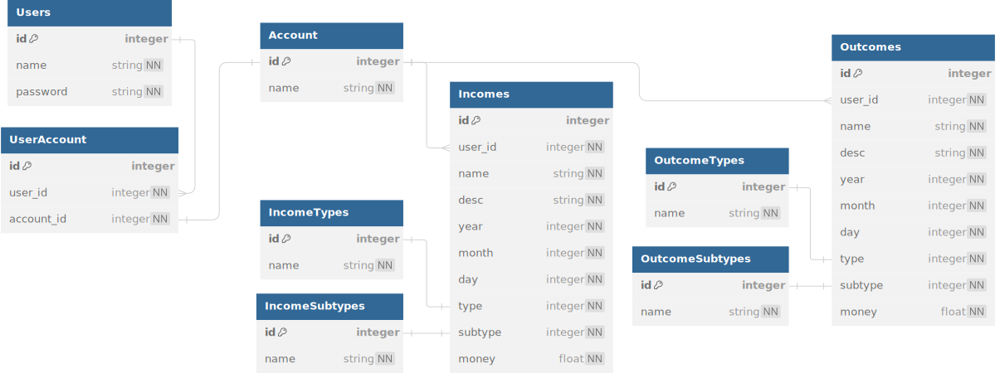

## Simple money management for more than one person.

Features:
- add income and outcome
- modify incomes and outcomes


```
Person0 
        \
         backend
        / 
Person1  
```

Server is using [Flask](https://flask.palletsprojects.com/en/3.0.x/)

Client is using [React](https://react.dev/)

Database representation:



## Backend
Endpoints:

- [ ] getLastIncomes
- [ ] getLastOutcomes
- [ ] setIncome
- [ ] setOutcome
- [ ] deleteIncome
- [ ] deleteOutcome
- [ ] modifyIncome
- [ ] modifyOutcome
- [ ] getIncomeTypes
- [ ] getOutcomeTypes
- [ ] getIncomeSubtypes
- [ ] getOutcomeSubtypes

